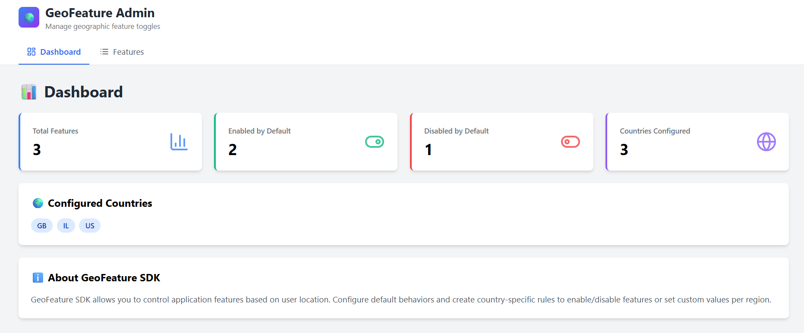

# 🌍 GeoFeature Admin Portal

**Modern web interface for managing geographic feature toggles**

[](https://noacohen6.github.io/GeoFeatureSDK-API/) [](https://react.dev) [](https://vitejs.dev)

---

## 🎯 What is This?

A React-based dashboard to manage feature toggles by country. Control which features are enabled where, without touching code or databases.

**Key Benefits:**
- ✅ Visual management - no API calls needed
- 🌍 Country-specific rules (IL, US, GB, etc.)
- 📊 Real-time statistics
- 🎨 Modern, responsive UI

---

## 🚀 Quick Start

```bash
cd admin-portal
npm install
npm run dev
```

Portal opens at **http://localhost:5173** 🎉

**Prerequisites:** Node.js 16+ and GeoFeature API running

---

## ✨ Features

| Feature | Description |
|---------|-------------|
| 📊 **Dashboard** | View stats: total features, enabled/disabled counts, countries configured |
| 🎯 **Feature Management** | Create, edit, delete features with simple forms |
| 🌍 **Geographic Rules** | Set country-specific behavior (status + optional values) |

---
## 📸 Screenshots

### Dashboard
View real-time statistics and configured countries.



---

### Features List
Manage all your features in one place with a clean table.


---

### Feature Form
Create and manage features with an intuitive form interface.


---

## ⚙️ Configuration

The `.env` file contains the API URL:

**Location:** `admin-portal/.env`

```env
VITE_API_URL=https://thundering-elfie-geofeature-a5030253.koyeb.app/api/v1
```

> 💡 The `.env` file is in Git because it only contains a public API URL.

**To update:** Change `.env` → commit → push → wait 2-3 mins → refresh browser

---

## 📁 Project Structure

```
admin-portal/
├── src/
│   ├── components/              # React components
│   │   ├── Dashboard.jsx        # Statistics dashboard
│   │   ├── FeatureList.jsx      # Features table view
│   │   └── FeatureForm.jsx      # Create/edit form
│   │
│   ├── services/
│   │   └── api.js               # API service layer (Axios)
│   │
│   ├── App.jsx                  # Main app component
│   ├── main.jsx                 # Entry point
│   └── index.css                # Global styles
│
├── public/                      # Static assets
├── index.html                   # HTML template
├── package.json                 # Dependencies
├── vite.config.js               # Vite configuration
├── tailwind.config.js           # Tailwind CSS config
├── .env                         # Environment variables
└── README.md                    # This file
```

---

## 📚 Usage Guide

### Creating a Feature

1. Click **"Features"** → **"Add Feature"**
2. Enter **feature name** (e.g., `dark_mode`)
3. Set **default status** (enabled/disabled)
4. *Optional:* Add geographic rules:
   - Country code (IL, US, GB...)
   - Status (enabled/disabled)
   - Value (optional, e.g., "paypal,credit_card")
5. Click **"Create Feature"** ✅

### Editing/Deleting

- **Edit:** Click ✏️ icon → modify → save
- **Delete:** Click 🗑️ icon → confirm

---

## 🚀 Deployment

### GitHub Pages (Automatic)

The portal is automatically deployed to GitHub Pages using GitHub Actions whenever you push changes to the `master` branch.

**Live URL:** https://noacohen6.github.io/GeoFeatureSDK-API/

#### How It Works

1. **You push changes** to the `master` branch on GitHub
2. **GitHub Actions triggers** automatically (configured in `.github/workflows/deploy-portal.yml`)
3. **Build process runs:**
   - Installs dependencies (`npm ci`)
   - Builds the production bundle (`npm run build`)
   - Creates optimized files in `dist/` folder
4. **Deployment happens** - the `dist/` folder is published to GitHub Pages
5. **Your changes are live** in 2-3 minutes! 🎉

#### Manual Deployment

If you need to trigger a deployment manually (e.g., to rebuild without code changes):

1. Go to the **Actions** tab in your GitHub repository
2. Select **"Deploy Admin Portal to GitHub Pages"** workflow
3. Click **"Run workflow"** button (top right)
4. Select branch (usually `master`)
5. Click **"Run workflow"** to start
6. Wait for completion (usually 2-3 minutes)

#### Updating the Portal

To deploy changes:
```bash
# Make your changes
git add .
git commit -m "Your changes description"
git push
```

GitHub Actions will automatically build and deploy. Check the **Actions** tab to monitor progress.

---

## 🔧 Tech Stack

- **React 18** - UI framework
- **Vite 6** - Build tool
- **Tailwind CSS 3.4** - Styling
- **Axios 1.7** - HTTP client

---

## 🐛 Troubleshooting

| Problem | Solution |
|---------|----------|
| **Blank page** | Check console (F12) → verify API is running |
| **Network error** | API is sleeping (wake it: open API URL in browser) |
| **Changes not showing** | Hard refresh (Ctrl+Shift+R) |
| **404 errors** | Feature doesn't exist - create it first |

**Debug checklist:**
1. Browser console (F12 → Console)
2. Network tab (F12 → Network)
3. Test API: `https://[your-api]/api/v1/features`
4. Check `.env` file
5. Try hard refresh


---

## 📋 Example Workflows

### Workflow 1: Regional Payment Methods

**Goal:** Enable different payment methods per country

**Steps:**
1. Create feature: `payment_methods`
2. Default Status: **Disabled**
3. Add Geographic Rules:
   - **IL:** Enabled, value=`paypal,credit_card`
   - **US:** Enabled, value=`paypal,apple_pay,google_pay,credit_card`
   - **DE:** Enabled, value=`paypal,sepa,credit_card`
4. Save

**Result:** Users in Israel, USA, and Germany see relevant payment options. Other countries see no payment methods (disabled by default).

---

### Workflow 2: Beta Feature Testing

**Goal:** Test new UI with Israeli users first

**Steps:**
1. Create feature: `new_ui_beta`
2. Default Status: **Disabled**
3. Add Geographic Rule:
   - **IL:** Enabled, value=`beta_v2`
4. Save
5. Monitor feedback from Israeli users
6. Gradually add more countries:
   - **US:** Enabled, value=`beta_v2`
   - **GB:** Enabled, value=`beta_v2`

**Result:** Controlled rollout of beta features by region.

---

### Workflow 3: Dark Mode Configuration

**Goal:** Enable dark mode everywhere except specific countries

**Steps:**
1. Create feature: `dark_mode`
2. Default Status: **Enabled**
3. Add Geographic Rules for exceptions:
   - **CN:** Disabled
   - **JP:** Disabled, value=`light_preferred`
4. Save

**Result:** Dark mode on by default, disabled in China and Japan.

---

## 💡 Best Practices

**Feature Names:**
- ✅ Use: `dark_mode`, `payment_methods`
- ❌ Avoid: `Dark Mode`, `feature-123`, non-English

**Default Status:**
- **Use `Enabled`** for general features that should be available to most users globally. This is ideal for standard functionality, UI improvements, or features that don't depend on location. Users in all countries will have this feature unless you explicitly disable it for specific regions.
- **Use `Disabled`** for region-specific features, experimental/beta functionality, or features that require custom configuration per country. This gives you granular control - the feature is off everywhere except where you explicitly enable it.

**Country Codes:**
- Use official 2-letter ISO codes (IL, US, GB, FR, DE...)
- Keep values simple and documented

---


## 🎉 You're Ready!

Start managing features by country with ease!

📍 **Live:** https://noacohen6.github.io/GeoFeatureSDK-API/  
📖 **Docs:** [Main Project](../README.md)

**Built with React, Vite, and Tailwind CSS**